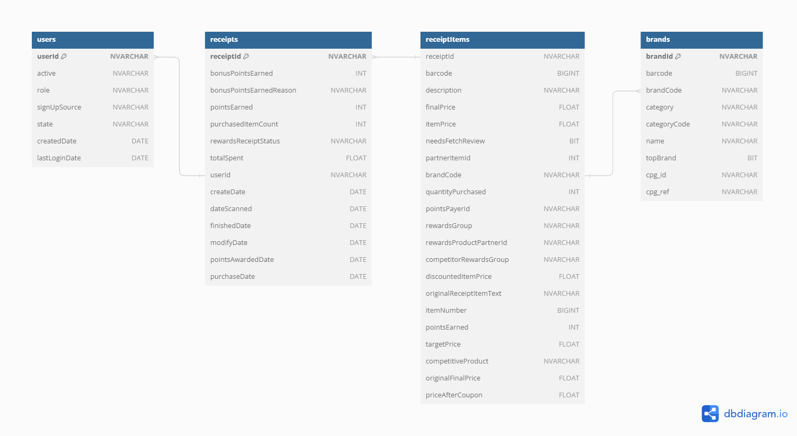

# fetch-rewards-data-analyst-assessment
Demonstrating how I reason about the Fetch Take Home assessment data and how I communicate my understanding of specific datasets to others.

## Requirements
- Review unstructured JSON data and diagram a new structured relational data model
- Generate a query that answers a predetermined business question
- Generate a query to capture data quality issues against the new structured relational data model
- Write a short email or Slack message to the business stakeholder

## Data Exploration
First, I transformed the data into a more usable format using Python. See my [Jupyter Notebook](./formatting-json-to-csv.ipynb). Using Python, I transformed the JSON files into a csv to be imported into a Microsoft SQL Server database. From there, I explored the datasets to identify what each record in the datasets represent and if there were any duplicate records within the tables.

I found that the brands and receipts tables represented one row per brand and receipt, respectively; however, the users table looks to contain duplicate userId's. Where there are 212 unique userId's, there are a total of 495 records meaning that there are duplicate records within the table. See [Identifying Duplicate Data](#identifying-duplicate-data) for a more detailed overview of the users duplicate data. Luckily, each record that has a duplicate userId, each column contains the same information, therefore I am simply using distinct records.


SQL used to identify if tables contain duplicates:
```sql
SELECT
  'users' AS tableName, 
  COUNT(*) AS totalRows, 
  COUNT(DISTINCT userId) AS UniqueIds, 
  CASE WHEN COUNT(*) > COUNT(DISTINCT userId) THEN 1 ELSE 0 END AS tableHasDuplicates
FROM 
  FetchRewards.dbo.users

UNION ALL

select
  'brands' AS tableName, 
  COUNT(*) AS totalRows, 
  COUNT(DISTINCT brandId) AS UniqueIds, 
  CASE WHEN COUNT(*) > COUNT(DISTINCT brandId) THEN 1 ELSE 0 END AS tableHasDuplicates
FROM 
  FetchRewards.dbo.brands

UNION ALL

select 
  'receipts' AS tableName, 
  COUNT(*) AS totalRows, 
  COUNT(DISTINCT receiptId) AS UniqueIds, 
  CASE WHEN COUNT(*) > COUNT(DISTINCT receiptId) THEN 1 ELSE 0 END AS tableHasDuplicates
FROM 
  FetchRewards.dbo.receipts
```
To keep each table one row per record, I created another table called ```receiptItems``` that was derived from a nested JSON object in the ```receipts``` table. The ```receipts``` table joins to ```receiptItems``` with a one-to-many relationship on ```receipts.receiptId = receiptItems.receiptId``` as seen in the Relational Data Model.

Next, I identified that the ```brands``` table is missing many records and contains ambiguous and inconsistent records. See [Identifying Incomplete Data](#identifying-incomplete-data) and [Identifying Ambiguous and Inconsistent Data](#identifying-ambiguous-and-inconsistent-data) for the discovery methodology. For this analysis, I did keep this dataset as is for simplicity, but when communicating with stakeholders and team leads, discussing the repercussions of this is imperative.

Lastly, in the ```receipts``` table, there are various records that make me raise an eyebrow, but without seeing the receipts and going row by row, I am unable to say for certain that there is a data integrity issue, so I did keep the receipt and receiptItems tables as is since they are unique rows, but similar to the brands dataset, ensure any caveats needed are communicated clearly. I identified this simply through scanning the data. As a best practice, for data I am familiarizing myself with, scanning the table will a lot of the time catch issues that queries would have a difficult time identifying.

As an example, in the receipt items below, there looks to be 2 unique barcodes on the receipt, one with a description and one without.

- For barcode '075925306254', this has 2 line items, both with different prices and barcode '034100573065' has 3 line items (Description: 'MILLER LITE 24 PACK 12OZ CAN'), with a price of $1.00, which seems very low for this item.


## 1. Relational Data Model
The relational data model is based on the clean datasets (discussed above) with relationships based on primary keys and foreign keys.
- **NOTE**: The relationship between ```receiptItems.brandCode = brands.brandCode```, I believe would benefit from enhancing the ```receiptItems``` table with a "brandId" field since ```brands.brandId``` is a more consistent unique identifier within the table and joining on ```receiptItems.brandId = brands.brandId``` instead.



## 2. SQL Query (T-SQL)
I chose questions 3 and 4. Here is my query:
- Question 3: When considering average spend from receipts with 'rewardsReceiptStatus’ of ‘Accepted’ or ‘Rejected’, which is greater?
- Question 4: When considering total number of items purchased from receipts with 'rewardsReceiptStatus’ of ‘Accepted’ or ‘Rejected’, which is greater?
	- **NOTE**: 'FINISHED' is the equivelant of 'Accepted' as 'Accepted' was not available in the datasets.

```sql
SELECT
  r.rewardsReceiptStatus AS receiptStatus,
  ROUND(AVG(r.totalSpent),2) AS Average_totalSpent,
  SUM(r.purchasedItemCount) AS Total_purchasedItemCount
FROM
  FetchRewards.dbo.receipts r
WHERE
  r.rewardsReceiptStatus IN ('FINISHED', 'REJECTED')
GROUP BY
  r.rewardsReceiptStatus;
```
As seen below, 'FINISHED' receipts have a greater average total spend and total number of items purchased compared to 'REJECTED' receipts.


## 3. Data Quality
To evaluate data quality there are several factors to take into considerations that are given as examples in the below queries, such as:
- [Duplicate Data](#identifying-duplicate-data)
- [Ambiguous and Inconsistent Data](#identifying-ambiguous-and-inconsistent-data)
- [Incomplete Data](#identifying-incomplete-data)

### Identifying Duplicate Data
Using the ```users``` table for this example, we want to ensure that the table does not include any duplicate records.

The column "userId" in the ```users``` table should be the unique identifier within the table (ie. one row per userId). Using a few simple queries, we can quickly identify duplicates within the table.

This first approach is simply counting the total number of records in the table compared to the distinct number of userId's. Running the query below, we see that there are 495 total records in the table compared to the 212 unique userId's.
```sql
SELECT
	COUNT(*) AS totalUserRecords,
	COUNT(DISTINCT userId) AS uniqueUsers
FROM 
	FetchRewards.dbo.users u;
```


Understanding that there are duplicate userId's, is this coming from a specific user or multiple users? Running the query below, we see that there are several users that have 2+ records, two of which have 20 records ('54943462e4b07e684157a532', '5fc961c3b8cfca11a077dd33').
```sql
SELECT
	userId,
	COUNT(userId) AS countOfUserId 
FROM 
	FetchRewards.dbo.users u
GROUP BY
	USERID
ORDER BY
	COUNT(userId) DESC;
```


Let's take a look at the raw data of one of the userId's that have 20 records ('54943462e4b07e684157a532') to understand further if each row is the same. Upon executing the below query, each of the 20 rows returns the same information.
```sql
SELECT
	userId,
	active,
	[role],
	signUpSource,
	[state],
	CAST(DATEADD(ss, createdDate/1000, '1970-01-01') AS DATE) AS createDate,
	CAST(DATEADD(ss, lastLoginDate/1000, '1970-01-01') AS DATE) AS lastLoginDate
FROM 
	FetchRewards.dbo.users u
WHERE
  userId = '54943462e4b07e684157a532'
```
Being that these rows are the same, simply dropping the duplicate rows (or taking the distinct values) will resolve this issue.


### Identifying Ambiguous and Inconsistent Data
Using the ```brands``` table for this example, we want to ensure that "brandId" (unique identifier) does not map to multiple brands.

Running the below query, we see that there are 14 brandNames that are mapped to 2 brandId's:
```sql
SELECT
	[name] AS brandName,
	COUNT(brandId) AS countOfBrandId
FROM 
	FetchRewards.dbo.brands b
GROUP BY
	[name]
ORDER BY
	COUNT(brandId) DESC;
```


Let's take a look at 2 brandName's that have 2 brandId's ('Pull-Ups', 'Caleb's Kola'):
```sql
SELECT
	barcode,
	category,
	categoryCode,
	[name] AS brandName,
	topBrand,
	brandId,
	cpg_id,
	cpg_ref,
	brandCode
FROM 
	FetchRewards.dbo.brands b
WHERE 
	b.[name] IN ('Caleb''s Kola','Pull-Ups')
ORDER BY
	b.[name]
```
- Running the above query we identify ambiguity and consistency issues:
	- Pull-Ups has the same cpg_id and category but 2 different brandId's and barcodes
	- Further, Pull-Ups has 2 different brandCode's that are slightly different:
		- 'PULLUPS'
		- 'PULL UPS'
	- Caleb's Kola has 2 different cpg_id's and brandId's
		- Looking at the category column, we see 2 different values:
			- Beverages
			- Snacks
		- Similar to Pull-Ups, Caleb's Kola also has 2 different brandCode's that are slightly different:
			- CALEB'S KOLA
			- CALEBS KOLA


- Where these could technically be two different brands or cpg products, it is worth identifying and making the team who maintains the table aware of this to gain better understanding of the integrity of the data.

### Identifying Incomplete Data
The below query identifies NULL values dynamically within each column of a table to help understand the completeness of the data. If we consider the ```brands``` table, the query below quickly identifies that there are:
- 155 rows with a NULL category (13% of rows)
- 650 rows with a NULL categoryCode (56% of total rows)
- 612 rows with a NULL topBrand (52% of total rows)
- 269 rows with a NULL brandCode (23% of total rows)

```sql
DECLARE @null_sql VARCHAR(MAX)

SELECT
    @null_sql = COALESCE(@null_sql + ', ', '') +  'SUM(CASE WHEN ' + COLUMN_NAME + ' IS NULL THEN 1 ELSE 0 END) AS ' + COLUMN_NAME
FROM
    INFORMATION_SCHEMA.COLUMNS
WHERE
  TABLE_NAME = 'brands' --change 'brands' to another table (such as 'users') to understand data completeness of a different table in the database

SET @null_sql = 'SELECT ' + @null_sql

SET @null_sql = @null_sql + ' FROM brands'  --change 'brands' to another table (such as 'users') to understand data completeness of a different table in the database

PRINT @null_sql

EXEC(@null_sql)
```


## 4. Stakeholder Communication
Please see [Stakeholder Email](./stakeholder-email.pdf) for an example on how I communicate and reason about data with others who may not be fully familiar with the technical aspect. In the email, I provided a high level overview, a summary of findings, and provided a link to the in-depth overview of the data quality issues if they are interested in more information.
